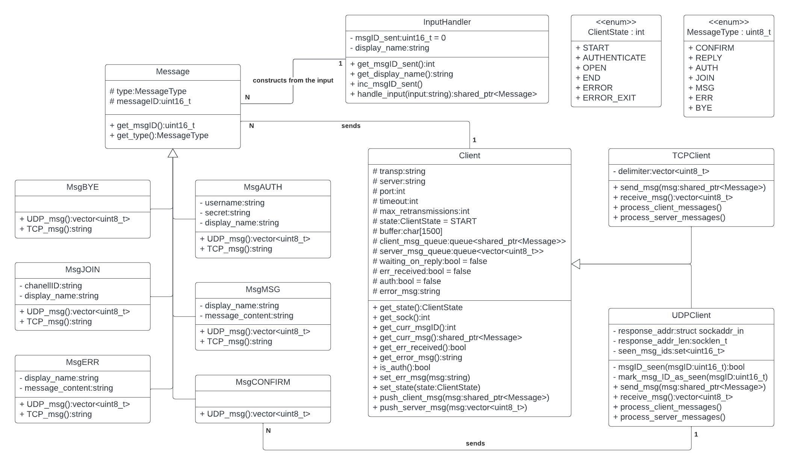

# IPK Project 1: Client for chat server using `IPK24-CHAT` protocol
Author: Adam Valík (xvalik05) @ FIT VUT 2024 <br>
License: MIT License. See the [LICENSE](LICENSE) file for details.

This project represents a client implementation written in C++ (standard C++20) for the `IPK24-CHAT` protocol, specified [here](https://git.fit.vutbr.cz/NESFIT/IPK-Projects-2024/src/branch/master/Project%201).

## Table of Contents
- [Usage](#usage)
- [Commands and Messages](#commands-and-messages)
- [CLI Argument Parsing](#cli-arg-parsing)
- [Main Loop](#main-loop)
- [Input Handler](#input-handler)
- [Message](#message)
- [Client](#client)
- [TCP Client](#tcp-client)
    - [Sending Messages](#sending-messages)
    - [Receiving Messages](#receiving-messages)
- [UDP Client](#udp-client)
    - [Sending Messages](#sending-messages-1)
    - [Receiving Messages](#receiving-messages-1)
- [Processing Client Messages](#processing-client-messages)
- [Processing Server Messages](#processing-server-messages)
- [UML Class Diagram](#uml-class-diagram)
- [Signal Interrupt](#signal-interrupt)
- [Piping a File](#piping-a-file)
- [Testing](#testing)
    - [Valgrind](#valgrind)
    - [TCP Testing](#tcp-testing)
        - [Authentication](#authentication)
        - [Exchanging messages](#exchanging-messages)
        - [Message buffering](#message-buffering)
        - [Signal interruption](#signal-interruption)
    - [UDP Testing](#udp-testing)
        - [Authentication and messages](#authentication-and-messages)
        - [Packet loss](#packet-loss)
        - [Server not responding](#server-not-responding)
- [Code documentation](#code-documentation)
- [Bibliography](#bibliography)

## Usage
The project is built by running `make`, consolidating it into a single binary executable file named `ipk24chat-client`.
```
Usage:
./ipk24chat-client -t [tcp|udp] -s [server IP/hostname] [-p port] [-d UDP confirmation timeout] [-r max UDP retransmissions]
```

| Argument | Value         | Possible Values       | Meaning or Expected Behavior                     |
|----------|---------------|-----------------------|--------------------------------------------------|
| `-t`     | User provided | `tcp` or `udp`        | Transport protocol used for connection          |
| `-s`     | User provided | IP address or hostname| Server IP or hostname                           |
| `-p`     | 4567          | uint16                | Server port                                     |
| `-d`     | 250           | uint16                | UDP confirmation timeout                        |
| `-r`     | 3             | uint8                 | Maximum number of UDP retransmissions           |
| `-h`     |               |                       | Prints program help output and exits            |

The user-provided arguments are mandatory, while the remainder are optional. Default values are used when not specified.

## Commands and Messages
- `/help`: Display the help message.
- `/auth <username> <secret> <display_name>`: Authenticate.
- `/join <channelID>`: Join a channel.
- `/rename <new_display_name>`: Change display name.
- `/exit`: Gracefully exit the application.
- User input without the command prefix `/` is interpreted as a message to be sent to the server.

Since the `/exit`command was not specified in the task, it is considered an extra feature.

## CLI Argument Parsing
Arguments are parsed and stored using an unordered map to maintain the relationships between arguments and their values. Based on the chosen transport protocol, a unique pointer to either `TCPClient` or `UDPClient` is constructed, invoking their respective constructors.

## Main Loop
The main loop remains active until an interruption or error signals the end of the program. The `poll()` function monitors activity on both standard input and the created socket to handle events such as user input or incoming messages. Signal interruptions, such as Ctrl+C, are caught, terminating the program. The input handler validates user input, constructs messages to be sent to the server, and handles end-of-file events. Received messages from the server are processed, and the loop waits for further events. Specific implementations for TCP and UDP variants are detailed below.

## Input Handler
The `InputHandler` parses input using `istringstream`, determining whether it is a command or message based on the first character (command prefix). Input is validated using regular expressions and the expected number of parameters. Invalid, unknown, or malformed commands are not processed, and the user is informed accordingly. Otherwise, the constructed message is returned.

## Message
The `Message` class contains common attributes and methods for all derived message types. Each message has its implementation of `UDP_msg` and `TCP_msg`, which populate the message attributes and construct it to be sent to the server via the specified transport protocol (byte stream, datagram).

## Client
Both TCP and UDP variants utilize a generalized `Client` class to ensure compatibility with the main loop and to manage common attributes and methods. The constructor initializes a socket and server address with the specified port and IP address, eventually resolving the hostname using `getaddrinfo`.

## TCP Client
TCP (Transmission Control Protocol) provides reliable, ordered, and error-checked delivery of data between applications. It establishes a connection using the `connect()` function before data transmission and ensures that all packets are received and in the correct order.

### Sending Messages
Messages are sent using the `send()` function, leveraging the established connection.

### Receiving Messages
Received data from the server are retrieved using `recv()`. The connection is considered closed if 0 bytes are returned, otherwise the data received from the server are processed in accordance with the TCP protocol. It's important to note that in a single `recv()` call, more than one message may be received, although at least one complete message is guaranteed due to the buffer size (1500 bytes) and message size limitations specified in the protocol.

Upon receipt of data, messages are parsed using the delimiter `\r\n`. If the delimiter is detected, indicating the end of a message, the message is extracted and pushed to the `server_message_queue` for further processing.

In cases where incomplete fragments of a message are received, the remaining bytes are stored in a static vector until the subsequent recv() call. This ensures that messages are reconstructed accurately, even if they are split across multiple receive operations.


## UDP Client
UDP (User Datagram Protocol) is a connectionless protocol that offers faster communication but lacks reliability and ordering guarantees. It is suitable for applications where speed is prioritized over reliability. 

In the `UDPClient`'s constructor, the socket is set with a specified timeout to ensure resending messages if no confirmation is received within the specified time frame, enhancing reliability in unreliable network conditions.

### Sending Messages
Messages are sent using `sendto()`, specifying the server address. Initially, the authentication message is sent to the specified port. Upon receiving the first reply from the server, all subsequent messages are sent to a dynamically allocated port.

After sending a message, the client waits for a confirmation. Upon receiving any message other than the expected confirmation message with the correct message ID, the received message is immediately processed. If the confirmation does not arrive within a specific time frame, the socket encounters a timeout while waiting for the message, and the packet is considered lost. In such cases, the message is retransmitted up to a maximum number of times defined by `max_retransmissions`. After exceeding this limit without receiving a response from the server, the communication is terminated due to the server's lack of response. This mechanism ensures the reliability of communication by retransmitting lost packets and terminating communication if necessary.

### Receiving Messages
Received messages are obtained via `recvfrom()`, which also provides sender information to the `response_addr`, for sending other messages.

## Processing Client Messages
Client messages are sent individually when no message awaits a reply. Additional checks are enforced before sending messages to ensure that the user is not attempting to send a message when it is not permissible. In such cases, the user is promptly informed of the restriction.

## Processing Server Messages
Server messages are processed from the front of the `server_message_queue` based on their type. All messages undergo validation checks to ensure their integrity. In the case of a reply message, unwanted replies are disregarded, meaning that if there is no message waiting for a reply at the front of the `client_message_queue`, the received reply is ignored. The most critical aspect is the value indicating success or failure. A successful reply message for the authentication request signifies that the client has been authenticated and transitions to the open state.

`ERR` or `MSG` messages type print out the display name and message content to the appropriate standard output stream (stderr/stdout).

A `BYE` message from the server indicates the termination of communication.

In the UDP protocol, each received message is confirmed regardless of its result or validity to ensure reliable communication.

### Message ID Check
UDP variant also has to handle the possibility of packet duplication. Therefore each message includes an unique ID. IDs are tracked to ensure message integrity.

## UML Class Diagram


## Signal Interrupt
Aside the `/exit` command, signal interrupts (e.g., Ctrl+C) are handled gracefully throughout the program, allowing for a controlled termination.

## Piping a File
Users can communicate with the server using the client application and can also automate this process by piping a text file as input (`./program < in.txt` or `cat in.txt | ./program`).

## Testing
During the implementation phase, rigorous testing was conducted to ensure the functionality and robustness of the client application. Various edge cases were tested iteratively to identify and address potential issues. The basic functionality was finally verified on the reference server `anton5.fit.vutbr.cz`. For both variants, debug statements were strategically placed within the codebase to facilitate tracking and analysis of the communication. Some of the test cases for both variants are specified below.

### Valgrind
The client application was tested for both variants using Valgrind to ensure memory safety and stability. After running the application with an input consisting of 34 commands and messages, Valgrind's memory checking tools encountered no memory leaks. This indicates that the client application manages memory appropriately and does not exhibit any memory-related issues during runtime.
```
==17183== HEAP SUMMARY:
==17183==     in use at exit: 0 bytes in 0 blocks
==17183==   total heap usage: 323,524 allocs, 323,524 frees, 58,983,787 bytes allocated
==17183== 
==17183== All heap blocks were freed -- no leaks are possible
==17183== 
==17183== For counts of detected and suppressed errors, rerun with: -v
==17183== ERROR SUMMARY: 0 errors from 0 contexts (suppressed: 0 from 0)
```

### TCP Testing
The TCP variant of the client application was tested using **netcat** ([man page](https://www.commandlinux.com/man-page/man1/nc.1.html)), a versatile networking utility that allows for easy creation of TCP connections, using:
```
nc -4 -c -l -v 127.0.0.1 4567
```
as server in one terminal and the client in the second:
```
./ipk24chat-client -t tcp -s localhost -p 4567
```

#### Authentication
Failure during authentication leads to informing the user and waiting for another try.
```
INFO: Server socket: 127.0.0.1 : 4567
Client: Connected to server
Client: Waiting on poll()
/auth xvalik05 wrongpassword adam
InputHandler: AUTH message ready
Client: Pushing client message
Client: Processing client messages
Client: Sending message to server: AUTH xvalik05 AS adam USING wrongpassword
Client: Waiting on reply
Client: Waiting on poll()
Client: Handle incoming message
Client: Processing server messages
Client: Received reply
Failure: Invalid password
Client: waiting on poll()
/auth xvalik05 password adam
InputHandler: AUTH message ready
Client: Pushing client message
Client: Processing client messages
Client: Sending message to server: AUTH xvalik05 AS adam USING password
Client: Waiting on reply
Client: Waiting on poll()
Client: Handle incoming message
Client: Processing server messages
Client: Received reply
Success: Authenticated!
```
```
nc -4 -c -l -v 127.0.0.1 4567
AUTH xvalik05 AS adam USING wrongpassword
reply nok is Invalid password
AUTH xvalik05 AS adam USING password
reply ok is Authenticated!
```

Authentication proccess will be in further test cases omitted.

#### Exchanging messages
```
Client: Waiting on poll()
hello from user
InputHandler: MSG message ready
Client: Pushing client message
Client: Processing client messages
Client: Sending message to server: MSG FROM user IS hello from user
Client: Not waiting on reply -> popping
Client: Waiting on poll()
Client: Handle incoming message
Client: Processing server messages
Client: Received message
server: hello from server
Client: waiting on poll()
```
```
nc -4 -c -l -v 127.0.0.1 4567
MSG FROM user IS hello from user
MSG FROM server IS hello from server
```

#### Message buffering
Messages or commands can be typed in by the user. However, they are buffered until a reply is received for the `/auth` or `/join` command, after which they are sent.
```
Client: Waiting on poll()
/join channel2
InputHandler: JOIN message ready
Client: Pushing client message
Client: Processing client messages
Client: Sending message to server: JOIN channel2 AS user
Client: Waiting on reply
Client: Waiting on poll()
msg1
InputHandler: MSG message ready
Client: Pushing client message
Client: Waiting on poll()
msg2
InputHandler: MSG message ready
Client: Pushing client message
Client: Waiting on poll()
Client: Handle incoming message
Client: Processing server messages
Client: Received reply
Success: Channel 2 joined.
Client: Processing client messages
Client: Sending message to server: MSG FROM user IS msg1
Client: Not waiting on reply -> popping
Client: Processing client messages
Client: Sending message to server: MSG FROM user IS msg2
Client: Not waiting on reply -> popping
Client: Waiting on poll()
```
```
JOIN channel2 AS user
REPLY OK IS Channel 2 joined.
MSG FROM user IS msg1
MSG FROM user IS msg2
```

#### Signal interruption
SIGINT is properly handled as discussed [here](#signal-interrupt).
```
Client: Waiting on poll()
^C
Client: End of main loop: Signal Interrupt
Client: Sending message to server: BYE
Client: Gracefully exiting
```
```
BYE
```


### UDP Testing
For the UDP variant, testing was performed using a [**student distributed server**](https://github.com/okurka12/ipk_proj1_livestream/blob/main/ipk_server.py):
```
python3 ipk_server.py
```
as server in one terminal and the client in the second:
```
./ipk24chat-client -t udp -s localhost -p 4567
```
The server implementation was edited for various test cases. 

#### Authentication and messages
The reply was delayed and the user managed to write a message in the meantime. The dynamic change of ports when authenticating is also visible there.
```
INFO: Server socket: 127.0.0.1 : 4567
Client: Waiting on poll()
/auth xvalik05 password adam
InputHandler: AUTH message ready
Client: Pushing client message
Client: Processing client messages
Client: Sending auth message to specified port
Client: Waiting for confirmation
Client: Auth message confirmed from port: 4567
Client: Waiting on reply
Client: Waiting on poll()
hello
InputHandler: MSG message ready
Client: Pushing client message
Client: Waiting on poll()
Client: Handle incoming message
Client: Message came from port: 53562
Client: Processing server messages
Client: Received reply
Success: Hi, adam, this is a successful REPLY message to your AUTH message id=0.
Client: Sending confirmation for messageID 44116
Client: Processing client messages
Client: Sending message to dyn port
Client: Waiting for confirmation
Client: The message was sent and also confirmed
Client: Not waiting on reply -> popping
Client: Waiting on poll()
Client: Handle incoming message
Client: Message came from port: 53562
Client: Processing server messages
Client: Received message
Server: Hi, adam! This is a reply MSG to your MSG id=1
Client: Sending confirmation for messageID 23757
```

#### Packet loss
The following test case demonstrates that if the confirmation is not received within the specified confirmation timeout, the packet is considered lost during transmission and is resent.
```
Client: Waiting on poll()
message    
InputHandler: MSG message ready
Client: Pushing client message
Client: Processing client messages
Client: Sending message to dyn port
Client: Waiting for confirmation
Client: Received -1 bytes
INFO: Retransmission 1
Client: Sending message to dyn port
Client: Waiting for confirmation
Client: Received 3 bytes
Client: The message was sent and also confirmed
Client: Waiting on poll()
```

#### Server not responding
The message is retransmitted up to `max_retransmissions` times. After exceeding this limit without receiving a response from the server, the communication is terminated.
```
Client: Waiting on poll()
hello?
InputHandler: MSG message ready
Client: Pushing client message
Client: Processing client messages
Client: Sending message to dyn port
Client: Waiting for confirmation
Client: Received -1 bytes
INFO: Retransmission 1
Client: Sending message to dyn port
Client: Waiting for confirmation
Client: Received -1 bytes
INFO: Retransmission 2
Client: Sending message to dyn port
Client: Waiting for confirmation
Client: Received -1 bytes
INFO: Retransmission 3
Client: Sending message to dyn port
Client: Waiting for confirmation
Client: Received -1 bytes
INFO: Server is not responding
Client: End of main loop: Client is in END state
Client: Gracefully exiting
```

## Code documentation
The client application is documented using Doxygen annotations. These annotations provide descriptions of classes, methods, variables, and parameters. Generated documentation can be easily produced by running `make doc`.

## Bibliography
1. Project 1 - IPK-Projects-2024 [online]. Available at: https://git.fit.vutbr.cz/NESFIT/IPK-Projects-2024/src/branch/master/Project%201
2. Linux man pages [online]. Available at: https://linux.die.net/man/
3. Beej's Guide to Network Programming, Hall B. _Using Internet Sockets_ [online]. April 2023. Available at: https://beej.us/guide/bgnet/html/
4. UDP testing server, Vít Pavlík _provided student distributed server_ available at: https://github.com/okurka12/ipk_proj1_livestream/blob/main/ipk_server.py
5. Netcat man page _nc - TCP/IP swiss army knife_ [online]. Available at: https://www.commandlinux.com/man-page/man1/nc.1.html
6. RFC5234, Crocker D. and Overell P. _Augmented BNF for Syntax Specifications: ABNF_ [online]. January 2008. Available at: https://datatracker.ietf.org/doc/html/rfc5234
7. RFC9293, Eddy W. _Transmission Control Protocol (TCP)_ [online]. August 2022. Available at: https://datatracker.ietf.org/doc/html/rfc9293
8. RFC768, Postel J. _User Datagram Protocol (UDP)_ [online]. March 1997. Available at: https://datatracker.ietf.org/doc/html/rfc768